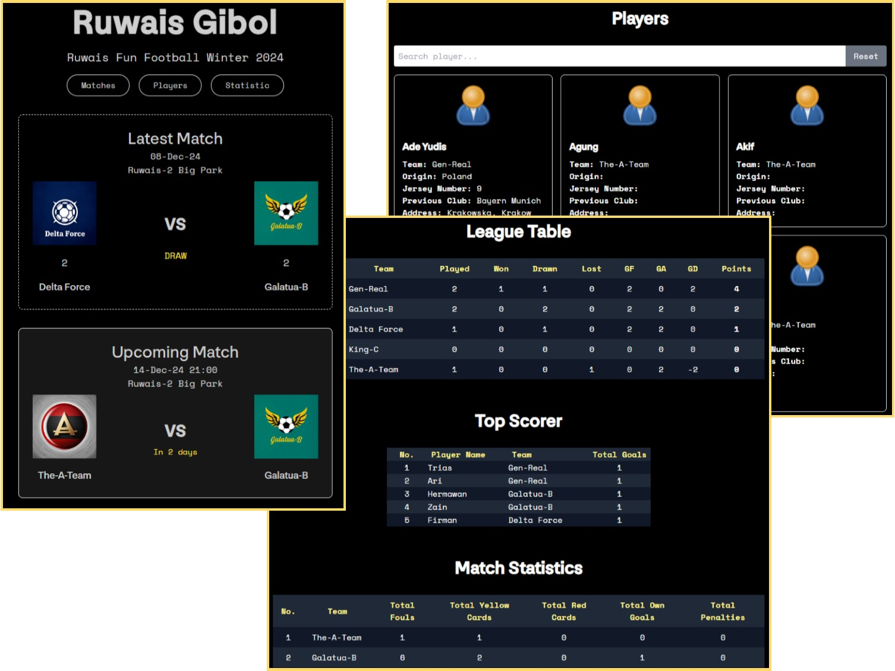

# Project : Ruwais Gibol
***************************************************************
NextJS: Build Football Match Update and Statistic

## Notes:
- Started at: Week-1 of Dec24
- Machine: NextJS v.12.1.0
- Web Deploy: vercel.com
- Packages: PWA, Tailwind, Typescript
- Backend: NA
- DB: Supabase
- API: NA

## Howto:
- Clone Repository
- Goto root folder
- $ npm install
- Make new file name it: ".env.local" in root folder
- Add these to .env.local file:
> NEXT_PUBLIC_SUPABASE_URL = **[fill_with_supabase_URL]**
> NEXT_PUBLIC_SUPABASE_ANON_KEY = **[fill_with_supabase_anon_key]**
> NEXT_PUBLIC_BASE_URL = **[http://localhost:3000/]**
> NEXT_PUBLIC_IMG_URL = **[http://localhost:3000/images/]**
> NEXT_PUBLIC_SITE_NAME = **[Ruwais Gibol Online]**    

## Login:
- gibol_xx@ruwaiskita.online

## References:
- https://www.youtube.com/watch?v=dgaAh0Dv0kc
- https://www.youtube.com/watch?v=QXxy8Uv1LnQ&t=195s
- https://krimsonhart.medium.com/how-i-built-my-portfolio-using-next-js-and-sqlite-db-part-2-37595ca4dc40

- Random Images: [https://i.pravatar.cc/200](https://i.pravatar.cc/200)
- Random Images: [https://picsum.photos/200](https://picsum.photos/200)
- Remove BG: [https://www.remove.bg/](https://www.remove.bg/)
- Unsplash Images: https://source.unsplash.com/[IMAGE ID]
- Color Ref: [Colors](https://coolors.co/palettes/trending)
- Svg Icon Collection: [SVG Icons](http://svgrepo.com)
- Github Emoji Collection (for Markdown): [Emoji](https://github.com/ikatyang/emoji-cheat-sheet)
- Emoji Collection (for HTML): [Emoji](https://html-css-js.com/html/character-codes/)
- Docs and Diagrams platform for engineering teams: [Eraser.App](https://app.eraser.io/)
- Markdown Editor: [Markdown Editor](https://pandao.github.io/editor.md/index.html)
- Markdown to HTML: [Markdown to HTML](https://markdowntohtml.com)
- To Play and Test Tailwind: [Play tailwind](https://play.tailwindcss.com/)
- Tailwind Collection: [Tailwindflex](https://tailwindflex.com/)

## Snapshot:

